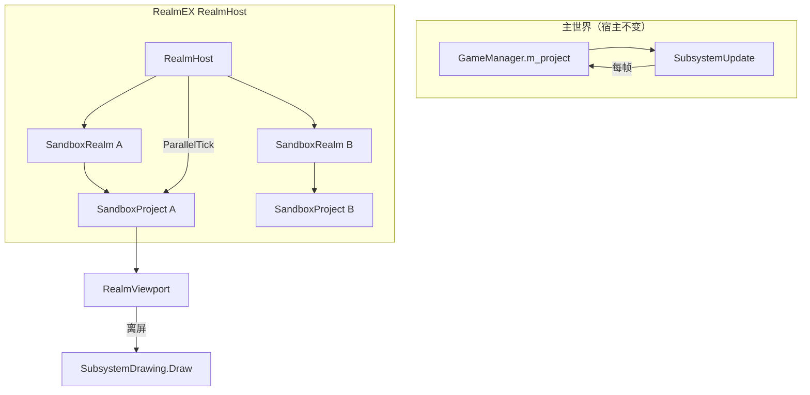

# 仿真沙箱 Realm — 目标架构（导航）

> **文档性质**：经确认的**目标架构与实施导航**，供 RealmEX 开发与下游内容模组对齐方向。  
> **前置事实**：[宿主耦合事实.md](宿主耦合事实.md)、[嵌套存档模式事实.md](嵌套存档模式事实.md)。  
> **状态**：方案已认可（2026-06）；当前仓库为 **P0 占位**（`RealmEXLoader` + `RealmHost` 空壳）。  
> **代码路径**：未特别说明时，宿主指 `GameDir` 或 NuGet `SurvivalcraftAPI.*`；框架指本仓库 `RealmEX/`。

---

## 1. 框架定位

RealmEX 是 Survivalcraft 2 的**可复用并行仿真沙箱**基础模组（`com.realmex`），服务：

| 场景 | 核心诉求 |
| --- | --- |
| **Ponder 式教程** | 真 `BlockEntity` / `Component` / Subsystem 语义，非 UI 内假地形 |
| **产线实验室** | 小范围、可配置、可重复搭建与观测 |
| **空间站等长期态**（下游玩法） | 可与主世界**并行**运转，且**可选**写入 `Realms/<id>/` |

**RealmEX 核心不包含**任何内容模组专有子系统（如工业流体、电网）。此类能力由依赖 `com.realmex` 的内容模组通过 **模板扩展** 注入。

---

## 2. 硬性需求（四项不可妥协）

| # | 需求 | 验收含义 |
| --- | --- | --- |
| **①** | **环境隔离**（最重要） | 沙箱内仿真状态不得泄漏到主世界 `GameManager.Project` |
| **②** | **高度自定义** | 布局、子系统集、时间倍率、副作用、并行策略由数据配置驱动 |
| **③** | **可选存档** | 默认内存态；开启时写入主存档下可配置子文件夹 |
| **④** | **可与主世界并行** | 主世界 tick 的同时，沙箱可独立推进仿真 |

---

## 3. 方案选型结论

| 方案 | ① | ② | ③ | ④ | 结论 |
| --- | --- | --- | --- | --- | --- |
| UI 假地形 | ❌ | △ | ❌ | △ | **不采用** |
| 主世界坐标划区 | △ | ○ | △ | ✅ | **不采用** |
| 嵌套存档 + `GameLoading` 换档 | ✅ | ○ | ✅ | ❌ | 仅借鉴目录 |
| **并行 Realm（独立 `Project`）** | ✅ | ✅ | ✅ | ✅ | **RealmEX** |

> **每个沙箱** = `SandboxProject` + `RealmProfile` + 可选 `RealmScene` + 可选 `Storyboard`；**`RealmHost`** 并行 tick；主世界独占 `GameManager.m_project`。

### 3.1 从嵌套存档模式吸收什么、不吸收什么

| 吸收 | 不吸收 |
| --- | --- |
| `Worlds/<主存档>/Realms/<realm_id>/` | `ChangeWorld` → `GameLoading` 换档 |
| 每 realm 独立 `Project.xml` + chunk | 跨维 XML 合并到主档 |

见 [嵌套存档模式事实.md](嵌套存档模式事实.md)。

---

## 4. 总体架构



### 4.1 关键不变量

1. **`GameManager.m_project` 永远指向主世界**。
2. **隔离边界是 `Project` 实例**（各 Subsystem 单例互不复用）。
3. 沙箱 tick / Hook 须显式传递 `sandboxProject`，勿假设 `GameManager.Project`。
4. **仿真与渲染解耦**：未打开 UI 时可只 tick 不 `Draw`。

---

## 5. 核心类型与代码布局（RealmEX）

| 类型 | 建议路径 | 职责 |
| --- | --- | --- |
| **`SandboxProject`** | `SandboxProject.cs` | `Project` 子类：沙箱标记、`Save`/`Dispose` 护栏 |
| **`SandboxSubsystemPlayers`** | `Subsystems/SandboxSubsystemPlayers.cs` | 避免空玩家列表跳 `Player` 屏 |
| **`RealmHost`** | `RealmHost.cs` | 创建/销毁/Tick/持久化索引 |
| **`SandboxRealm`** | `SandboxRealm.cs` | 单域：`SandboxProject` + Profile + Viewport |
| **`RealmProfile`** | `RealmProfile.cs` | 策略配置 |
| **`RealmScene`** | `RealmScene.cs` | 布局加载 |
| **`RealmBootstrap`** | `RealmBootstrap.cs` | 从 `SandboxProjectTemplate` xdb 组装 `ProjectData` |
| **`RealmViewport`** | `RealmViewport.cs` | 离屏渲染 |
| **`Storyboard/*`** | `Storyboard/` | 叙事协程 API |
| **`IRealmProjectTemplateContributor`** | `Extensibility/` | 内容模组扩展子系统列表（待实现） |
| **`RealmEXLoader`** | `RealmEXLoader.cs` | Mod 入口、Hook 注册 |

**xdb**：`Assets/RealmEX/SandboxProjectTemplate.xdb`（Minimal 预设，无内容模组成员）。

### 5.1 `RealmProfile` 预设 `SubsystemSet`

| 预设 | RealmEX 内置 | 内容模组扩展 |
| --- | --- | --- |
| `Minimal` | 地形、时间、绘制、方块行为 | — |
| `Extended` | Minimal + 可配置副作用开关 | 通过 Contributor 挂接 |
| `FullCustom` | 完全由 Contributor + xdb 决定 | 工业模组挂 Fluid/VoltNet 等 |

**禁止**在 RealmEX 核心引用内容模组程序集或类型名。

---

## 6. `SandboxProject` 子类：宿主坑统一跳过层

凡需绕过宿主默认行为，优先通过 **`SandboxProject` + `SandboxProjectTemplate`** 集中处理。

| 坑 | 对策 |
| --- | --- |
| `SubsystemPlayers` 空列表跳屏 | `SandboxSubsystemPlayers` 或 dummy `PlayerData` |
| `Save()` 污染主存档 | `Persistence=Off` 禁止写盘；`On` 强制 `Realms/<id>/` |
| 误挂 `GameManager` | `RealmBootstrap` 仅产出 `SandboxProject` |
| `SubsystemTerrain` 依赖链过重 | 独立 Minimal 模板，按 Profile 裁剪 |
| 离屏 `GameWidget` 泄漏 | `RealmViewport.Dispose` 先清理 |

见 [宿主耦合事实.md](宿主耦合事实.md)。

---

## 7. 持久化：`Realms/<id>/`

```text
Worlds/<主存档>/
  Project.xml
  Chunks*.dat
  Realms/
    <realm_id>/
      realm.meta.json
      Project.xml
      Chunks*.dat
```

| `Persistence` | 行为 |
| --- | --- |
| **Off** | 内存沙箱，`Dispose` 即销毁 |
| **On** | 读写子目录；主档仅可选索引，**不**合并沙箱 ECS |

下游若需「主档记录有哪些 realm」，在**内容模组**主世界 Subsystem 中实现索引，勿写入 RealmEX 核心的内容专有逻辑。

---

## 8. 并行 tick 与渲染

```text
每帧:
  1. 宿主 SubsystemUpdate（主世界）
  2. RealmHost.TickParallel(dt)  // 按 Profile.ParallelTick / TickBudgetMs
  3. RealmViewport.Draw()        // 按需
```

离屏：`Display.RenderTarget = camera.ViewTexture` → `SubsystemDrawing.Draw(camera)`。

---

## 9. 下游内容模组集成（规划）

| 集成点 | 所在层 |
| --- | --- |
| `modinfo.json` → `"com.realmex"` | 内容模组 |
| `IRealmProjectTemplateContributor` | 注册工业子系统等 |
| Ponder Dialog / `Storyboard` 数据 | 内容模组 Assets |
| `SubsystemRealmRegistry`（空间站索引） | 内容模组主世界 Subsystem + xdb |

**工业时代 2** 计划在 P0 稳定后依赖 RealmEX；当前主仓**不声明**该依赖。

---

## 10. 明确不实施的路径

1. UI 内假 `Terrain` 当沙箱  
2. 主世界远区划区  
3. 以 `ChangeWorld` / `GameLoading` 作为沙箱主运行时  
4. 将沙箱 `Project` 设为 `GameManager.Project`  
5. 在 RealmEX 核心写入内容模组（工业/化学等）专有 API  

---

## 11. 验证里程碑

| 步骤 | 通过标准 |
| --- | --- |
| **M1 隔离** | 沙箱内设备注册不影响主世界 |
| **M2 并行** | 主世界与沙箱同时推进 tick |
| **M3 自定义** | 换 `RealmScene` 不重写框架 C# |
| **M4 可选存档** | Off 无残留；On 可恢复子目录 |

---

## 12. 实施阶段

| 阶段 | 交付物 |
| --- | --- |
| **P0**（当前） | `RealmEXLoader`、`RealmHost` 占位、CI、文档、Minimal xdb 骨架 |
| **P1** | `SandboxProject`、`SandboxSubsystemPlayers`、`RealmBootstrap`、M1 |
| **P2** | `RealmHost.TickParallel`、M2 |
| **P3** | `RealmScene`、`Storyboard`、`RealmViewport` |
| **P4** | `Realms/<id>/` 持久化、M4 |
| **P5** | `IRealmProjectTemplateContributor`、下游接入文档 |

---

## 13. 决策记录

| 日期 | 决策 |
| --- | --- |
| 2026-06 | 独立仓库 [RealmEX](https://github.com/CS-LX/RealmEX)，包名 `com.realmex` |
| 2026-06 | 并行 `SandboxProject` 为唯一满足四项需求的方案 |
| 2026-06 | 宿主坑通过 `SandboxProject` 子类 + 配套模板集中处理 |
| 2026-06 | 内容模组语义不进 RealmEX 核心 |

---

*事实性宿主变更先更新 [宿主耦合事实.md](宿主耦合事实.md)，再同步本导航。*
